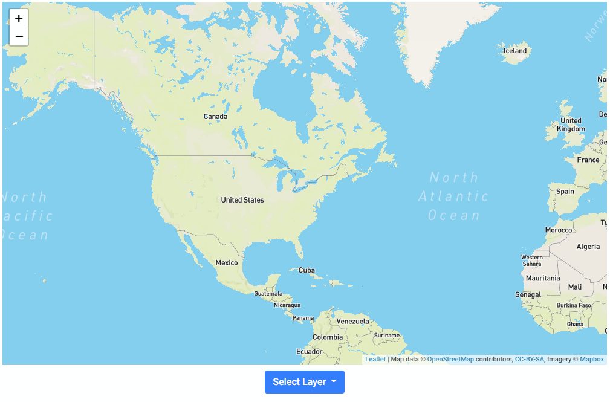
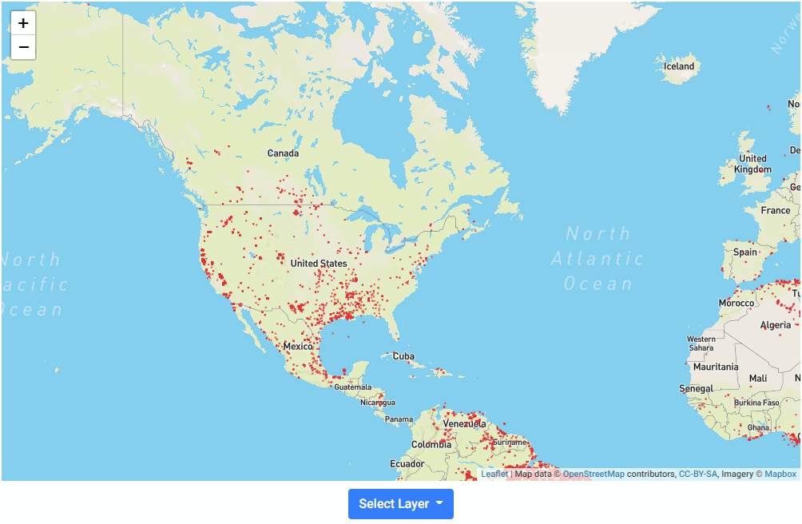
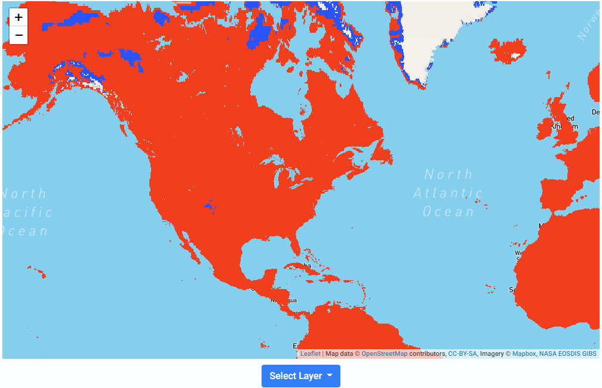

# NASA SpaceApp Challenge 2020

User friendly webapp that allows users to get a visual representation of satalite data, you can check out the site [here](https://spysly.github.io/nasa-spaceapp/).

## Index
[Demo](#demo)
[Uses](#uses)
[Team](#team)

## Demo
```
Map without filter
```


```
Map with fire filter
```


```
Map with warm cold filter
```


## Uses 
Upon entering the site press the `Try out our map here` button.
The user will be taken to a live map image where they can scroll around.
Pressing `Select Layer` will allow the user to add layers to see visual 
satalite data

## Team
